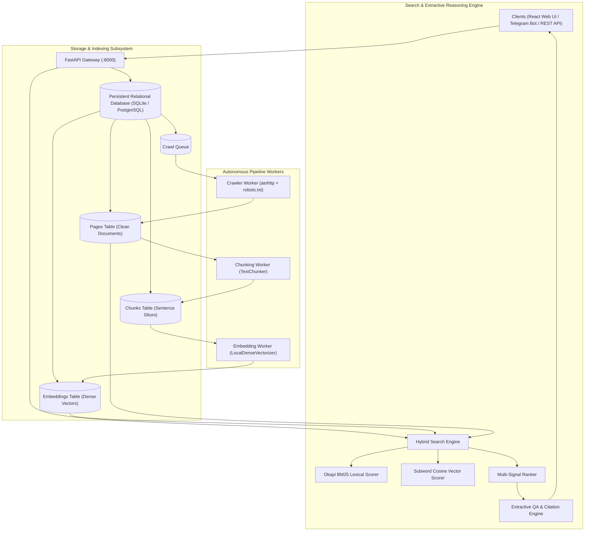

# ScrapAI Architecture Specification

This document details the architectural design, data pipelines, mathematical ranking algorithms, and zero-API semantic vectorization engine of **ScrapAI**.

---

## 1. System Topology

ScrapAI is designed as an asynchronous, worker-coordinated content ingestion and search platform:



---

## 2. Zero-API Semantic Vectorizer

ScrapAI features a deterministic, high-dimensional local dense vectorizer that requires **zero external API keys, GPUs, or heavy neural dependencies**:

### Character Subword & Token Hashing
Given an input text $T$:
1. Text is normalized (lowercased, punctuation-stripped) and tokenized into words and character $n$-grams ($n \in [3, 5]$).
2. Each subword $s$ is hashed into an index $k = \text{hash}(s) \pmod D$, where $D = 128$ (or configured vector dimension).
3. A sign hash $h_{\text{sign}}(s) \in \{-1, +1\}$ determines polarity to minimize hash collisions.
4. Term frequency (TF) and inverse document frequency (IDF) weights are accumulated:
   $$V_k = \sum_{s \in T} \text{TF}(s) \cdot \text{IDF}(s) \cdot h_{\text{sign}}(s)$$
5. The vector is $L_2$-normalized to unit sphere:
   $$\hat{V} = \frac{V}{\|V\|_2}$$

### Cosine Similarity
Vector similarity between query $\hat{Q}$ and document chunk $\hat{D}$ is calculated as:
$$\text{Sim}_{\text{vec}}(\hat{Q}, \hat{D}) = \hat{Q} \cdot \hat{D} = \sum_{i=1}^D \hat{Q}_i \cdot \hat{D}_i$$

---

## 3. Hybrid Multi-Signal Ranking Algorithm

Candidate documents are retrieved and evaluated across 5 weighted signals:

$$\text{Score}_{\text{final}} = w_1 \cdot S_{\text{vector}} + w_2 \cdot S_{\text{BM25}} + w_3 \cdot S_{\text{title}} + w_4 \cdot S_{\text{domain}} + w_5 \cdot S_{\text{freshness}}$$

### Default Weights:
- **Vector Similarity ($w_1 = 0.45$)**: Semantic concept matching.
- **BM25 Keyword Match ($w_2 = 0.25$)**: Exact term salience.
- **Title Token Overlap ($w_3 = 0.15$)**: Direct title relevance.
- **Domain Authority ($w_4 = 0.10$)**: Root domain quality.
- **Freshness & Length ($w_5 = 0.05$)**: Recency and content depth.

---

## 4. Extractive QA & Reasoning Engine

For natural language questions (`POST /api/v1/query/answer`), ScrapAI performs extractive reasoning:
1. **Candidate Retrieval**: Identifies the top $K$ highest-scoring chunks across Vault documents.
2. **Sentence Salience Scoring**: Splits chunks into sentences and computes query-term density and lexical relevance for each sentence.
3. **Synthesis & Deduplication**: Selects top non-redundant sentences and constructs an answer narrative.
4. **Citation Anchoring**: Appends citation badges `[1]`, `[2]` mapped directly to the source document URLs.

---

## 5. Relational Database Schema

```sql
-- Pages: Clean scraped web documents
CREATE TABLE pages (
    id INTEGER PRIMARY KEY AUTOINCREMENT,
    url VARCHAR NOT NULL UNIQUE,
    domain VARCHAR,
    title VARCHAR,
    content TEXT,
    meta_description TEXT,
    author VARCHAR,
    language VARCHAR DEFAULT 'en',
    word_count INTEGER DEFAULT 0,
    content_hash VARCHAR(64),
    status_code INTEGER DEFAULT 200,
    crawl_time DATETIME DEFAULT CURRENT_TIMESTAMP,
    embedded BOOLEAN DEFAULT 0
);

-- Chunks: Sentence-bounded text slices
CREATE TABLE chunks (
    id INTEGER PRIMARY KEY AUTOINCREMENT,
    page_id INTEGER NOT NULL REFERENCES pages(id) ON DELETE CASCADE,
    chunk_text TEXT NOT NULL,
    chunk_index INTEGER NOT NULL,
    token_count INTEGER DEFAULT 0,
    created_at DATETIME DEFAULT CURRENT_TIMESTAMP
);

-- Embeddings: Dense vectors stored per chunk
CREATE TABLE embeddings (
    id INTEGER PRIMARY KEY AUTOINCREMENT,
    chunk_id INTEGER NOT NULL REFERENCES chunks(id) ON DELETE CASCADE,
    vector TEXT NOT NULL,
    model_name VARCHAR DEFAULT 'local-tfidf-semantic',
    dimension INTEGER DEFAULT 128,
    created_at DATETIME DEFAULT CURRENT_TIMESTAMP
);

-- Crawl Queue: Target management
CREATE TABLE crawl_queue (
    id INTEGER PRIMARY KEY AUTOINCREMENT,
    url VARCHAR NOT NULL,
    domain VARCHAR,
    status VARCHAR DEFAULT 'queued',
    priority INTEGER DEFAULT 0,
    retries INTEGER DEFAULT 0,
    max_retries INTEGER DEFAULT 3,
    depth INTEGER DEFAULT 0,
    max_depth INTEGER DEFAULT 2,
    parent_url VARCHAR,
    error_message TEXT,
    scheduled_at DATETIME DEFAULT CURRENT_TIMESTAMP,
    processed_at DATETIME
);
```

---

## 6. Security & Politeness

- **Robots.txt Cache**: Evaluates `User-agent: *` and `User-agent: ScrapAI-Bot` rules before issuing requests.
- **Domain Rate Limiting**: Enforces a minimum delay (default 1.0s) between successive requests to the same origin domain.
- **Deduplication**: SHA-256 content hashing prevents re-crawling identical content across different URL paths.
- **Input Sanitization**: Pydantic validation prevents malicious payload injection.
