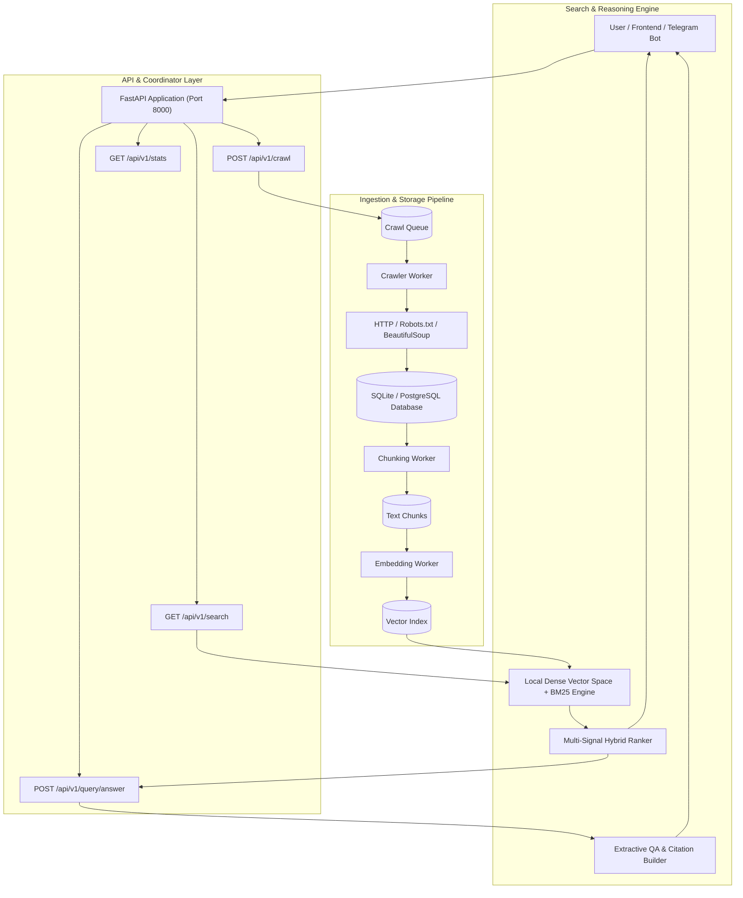

# 🕷️ ScrapAI

### Autonomous Web Crawling, Chunking, Embedding & Semantic Search Platform
**100% Offline-Ready • Zero External API Dependencies • Built-in Extractive QA Reasoning Engine**


---

## 🌟 Overview

**ScrapAI** is a modular, high-performance distributed platform engineered for autonomous web crawling, structured content extraction, text chunking, dense vector indexing, hybrid search, and extractive question answering.

Unlike basic scrapers or brittle wrapper tools, ScrapAI provides a complete **Data Ingestion → Chunking → Vectorization → Hybrid Ranking → Extractive Reasoning Pipeline** that operates **100% locally with zero external API keys or cloud AI dependencies**, while seamlessly leveraging optional neural models (`sentence-transformers`, `faiss`, `chromadb`) when available.

---

## 🚀 Key Features

- **Zero-API Semantic Search Engine**: High-dimensional subword & lexical vectorizer with cosine similarity, working out of the box with zero external API calls.
- **Hybrid Multi-Signal Ranking Engine**: Composite scoring blending Vector Similarity (45%), BM25 Keyword Match (25%), Title Token Overlap (15%), Domain Quality (10%), and Document Freshness (5%).
- **Extractive QA & Reasoning Engine (No-LLM)**: Synthesizes direct, citation-backed answers (`[1]`, `[2]`) by analyzing salient chunks across multiple documents.
- **Autonomous & Recursive Crawler**: Robots.txt politeness checking, user-agent rotation, domain rate-limiting, sitemap discovery (`/sitemap.xml`), and multi-depth link traversal.
- **Smart Text Chunking**: Sentence-boundary preserving chunker with configurable token windows and overlaps.
- **Persistent Storage**: Robust transactional SQLite database (and PostgreSQL ready) with tables for Pages, Chunks, Embeddings, CrawlQueue, Domains, and SearchLogs.
- **Unified Background Pipeline Manager**: Run crawler, chunker, and embedding workers in a single background process or standalone horizontally-scaled daemons.
- **Cyberpunk Web UI & Terminal**: Unified React SPA featuring Live Telemetry Dashboard, Target Acquisition Crawler, Data Vault with Inspection Modal, and Cyber Master Terminal.
- **Telegram Bot Assistant**: Complete bot with `/crawl`, `/search`, `/answer`, `/stats`, and `/help` commands.

---

## 🏗️ System Architecture



---

## ⚡ Quick Start

### 1. Prerequisites
- Python 3.10+
- Node.js 18+ (for frontend development/rebuilds)

### 2. Installation
```bash
# Clone the repository
git clone https://github.com/SmartGenzAI1/ScrapAI.git
cd ScrapAI

# Install Python dependencies
pip install -r requirements.txt

# (Optional) Build Frontend Assets
cd frontend
npm install
npm run build
cd ..
```

### 3. Start ScrapAI
```bash
# Start FastAPI backend (automatically launches background ingestion pipeline)
python backend/main.py
```
Open **[http://localhost:8000](http://localhost:8000)** in your browser to access the Cyber Master Terminal & Telemetry Dashboard!

---

## 📡 REST API Reference

| Endpoint | Method | Description |
|---|---|---|
| `/api/v1/health` | `GET` | System health check & feature flags |
| `/api/v1/stats` | `GET` | Real-time system telemetry and queue metrics |
| `/api/v1/crawl` | `POST` | Enqueue URLs for autonomous extraction & indexing |
| `/api/v1/crawl/direct` | `POST` | Immediately scrape and index a single URL |
| `/api/v1/search` | `GET` / `POST` | Hybrid semantic search with ranked snippets |
| `/api/v1/query/answer` | `POST` | Extractive QA reasoning engine with source citations |
| `/api/v1/pages` | `GET` | Paginated view of indexed Vault documents |
| `/api/v1/pages/{id}` | `GET` / `DELETE` | Inspect or delete an indexed document and its chunks |
| `/api/v1/queue` | `GET` | View active crawl queue targets and status |
| `/api/v1/queue/clear` | `POST` | Purge pending crawl queue |
| `/api/v1/pipeline/run` | `POST` | Trigger an immediate pipeline processing cycle |
| `/api/v1/export` | `GET` | Export Vault documents in JSON or CSV format |

---

## 💻 Master Terminal CLI Directives

The built-in Cyber Terminal provides direct command-line control:

```text
$ help                 - Show command directory
$ status               - Real-time engine telemetry
$ target <url>         - Inject URL into crawl queue
$ crawl-direct <url>   - Immediately crawl & index URL
$ scan <query>         - Hybrid semantic search with scores
$ answer <question>    - Synthesize extractive answer with [1], [2] citations
$ pages                - List recent indexed documents
$ pipeline             - Trigger one pipeline cycle
$ clear                - Purge terminal display
```

---

## 🤖 Telegram Bot

To launch the Telegram bot:
```bash
export TELEGRAM_BOT_TOKEN="your_bot_token_here"
export API_URL="http://localhost:8000"
python telegram_bot.py
```

Commands supported:
- `/start` — Welcome & overview
- `/crawl <url>` — Ingest target URL
- `/search <query>` — Hybrid search
- `/answer <question>` — Synthesized answer with citations
- `/stats` — Engine metrics

---

## 🧪 Testing

ScrapAI includes an end-to-end automated test suite:

```bash
pytest tests/
# or
python tests/test_system.py
```

---

## 🐳 Docker Deployment

```bash
# Start all services with Docker Compose
docker-compose up --build
```

---

## 📄 License
MIT License © 2026 ScrapAI Contributors.
