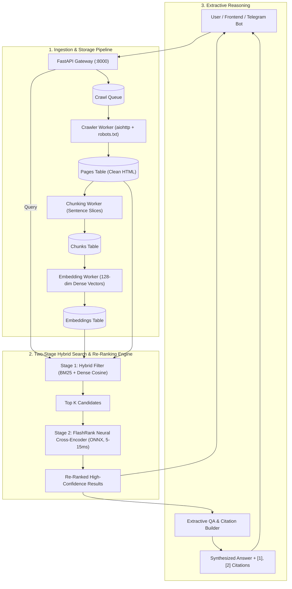

# 🕷️ ScrapAI

### Autonomous Web Crawling, Chunking, Embedding, Hybrid Search & Neural Re-Ranking Platform
**100% Offline-Ready • Zero External API Dependencies • Built-in Extractive QA Reasoning Engine**


---

## 📅 Latest Updates — September 26, 2026

Today, ScrapAI received a major upgrade introducing **Stage-2 Neural Cross-Encoder Re-Ranking**:

- ⚡ **Local FlashRank Integration (Open-Source Alternative to TypeSafe Jev)**: Upgraded the search and ranking engine with [FlashRank](https://github.com/PrithivirajDamodaran/FlashRank) (`ms-marco-TinyBERT-L-2-v2`). While models like TypeSafe AI's **Jev** offer System-One structured decision scoring via proprietary cloud APIs, **FlashRank delivers the same sub-15ms calibrated neural scoring 100% locally on CPU with ZERO external API keys, zero cloud costs, and complete offline privacy**.
- 🎯 **Two-Stage Retrieval Architecture**: First stage performs fast hybrid candidate filtering (BM25 + 128-dim dense subword vector space); second stage applies deep neural cross-attention scoring to re-order top results with high precision.
- 🔌 **New Endpoint (`POST /api/v1/search/rerank`)**: Added a dedicated route to re-rank arbitrary lists of candidate text passages directly on CPU.
- 📊 **Enhanced Dashboard & Telegram Bot**: The Cyberpunk Web UI and Telegram Bot now display live `⚡ FlashRank` confidence scores and telemetry indicators.
- 🧪 **Comprehensive Automated Test Suite**: Added 8 dedicated neural re-ranker tests, bringing the total suite to **20 automated tests passing in ~1.8s**.

---

## 🌟 Overview (Plain English)

**ScrapAI** is a self-hosted, modular knowledge engine that can:
1. **Crawl the Web Autonomously**: Ingest entire websites, single pages, or sitemaps while respecting rate limits and `robots.txt`.
2. **Chunk & Vectorize Locally**: Slice raw text into clean, sentence-bounded chunks and encode them into dense vectors without needing OpenAI, Anthropic, or external embedding APIs.
3. **Search & Re-Rank with Precision**: Search across millions of words using hybrid keyword + vector retrieval, followed by local neural cross-encoder re-ranking.
4. **Answer Questions with Citations (No-LLM Required)**: Synthesize concise answers backed by source citations (`[1]`, `[2]`) linked directly to the original web pages.

---

## 🚀 Key Features

- **⚡ Local Neural Cross-Encoder Re-Ranking**: Sub-15ms CPU re-ranking via FlashRank ONNX cross-encoders, eliminating cloud API costs and latency.
- **Zero-API Semantic Search Engine**: High-dimensional subword & lexical vectorizer with cosine similarity, working out of the box with zero external API calls.
- **Hybrid Multi-Signal Ranking**: Blends Cross-Encoder Attention (70%) with BM25 Keyword Match, Dense Vector Similarity, Title Token Overlap, and Domain Authority.
- **Extractive QA & Reasoning Engine (No-LLM)**: Synthesizes direct, citation-backed answers (`[1]`, `[2]`) by analyzing salient chunks across multiple documents.
- **Autonomous & Recursive Crawler**: Robots.txt politeness checking, user-agent rotation, domain rate-limiting, sitemap discovery (`/sitemap.xml`), and multi-depth link traversal.
- **Smart Text Chunking**: Sentence-boundary preserving chunker with configurable token windows and overlaps.
- **Persistent Storage**: Robust transactional SQLite database (and PostgreSQL ready) with tables for Pages, Chunks, Embeddings, CrawlQueue, Domains, and SearchLogs.
- **Unified Background Pipeline Manager**: Run crawler, chunker, and embedding workers in a single background process or standalone horizontally-scaled daemons.
- **Cyberpunk Web UI & Terminal**: Unified React SPA featuring Live Telemetry Dashboard, Target Acquisition Crawler, Data Vault with Inspection Modal, and Cyber Master Terminal.
- **Telegram Bot Assistant**: Complete bot with `/crawl`, `/search`, `/answer`, `/stats`, and `/help` commands.

---

## 🏗️ System Architecture


```mermaid
flowchart TD
    User["User / Frontend / Telegram Bot"] --> API["FastAPI Gateway (:8000)"]
    
    subgraph Ingestion_Pipeline ["1. Ingestion & Storage Pipeline"]
        API --> CrawlQueue[("Crawl Queue")]
        CrawlQueue --> CrawlerWorker["Crawler Worker (aiohttp + robots.txt)"]
        CrawlerWorker --> PagesTable[("Pages Table (Clean HTML)")]
        PagesTable --> ChunkerWorker["Chunking Worker (Sentence Slices)"]
        ChunkerWorker --> ChunksTable[("Chunks Table")]
        ChunksTable --> EmbeddingWorker["Embedding Worker (128-dim Dense Vectors)"]
        EmbeddingWorker --> EmbeddingsTable[("Embeddings Table")]
    end
    
    subgraph Two_Stage_Search ["2. Two-Stage Hybrid Search & Re-Ranking Engine"]
        API -->|Query| HybridFilter["Stage 1: Hybrid Filter (BM25 + Dense Cosine)"]
        EmbeddingsTable --> HybridFilter
        PagesTable --> HybridFilter
        HybridFilter --> TopCandidates["Top K Candidates"]
        TopCandidates --> FlashRankCross["Stage 2: FlashRank Neural Cross-Encoder (ONNX, 5-15ms)"]
        FlashRankCross --> FinalRanked["Re-Ranked High-Confidence Results"]
    end

    subgraph Reasoning_Engine ["3. Extractive Reasoning"]
        FinalRanked --> ExtractiveQA["Extractive QA & Citation Builder"]
        ExtractiveQA --> AnswerOut["Synthesized Answer + [1], [2] Citations"]
        AnswerOut --> User
        FinalRanked --> User
    end
```

---

## ⚡ Quick Start

### 1. Prerequisites
- Python 3.10+
- Node.js 18+ (for frontend development/rebuilds)

### 2. Installation
```bash
# Clone the repository
git clone https://github.com/SmartGenzAI1/ScrapAI.git
cd ScrapAI

# Install Python dependencies (includes FlashRank & ONNX Runtime)
pip install -r requirements.txt

# (Optional) Build Frontend Assets
cd frontend
npm install
npm run build
cd ..
```

### 3. Start ScrapAI
```bash
# Start FastAPI backend (automatically launches background ingestion pipeline)
python backend/main.py
```
Open **[http://localhost:8000](http://localhost:8000)** in your browser to access the Cyber Master Terminal & Telemetry Dashboard!

---

## 📡 REST API Reference

| Endpoint | Method | Description |
|---|---|---|
| `/api/v1/health` | `GET` | System health check, version, and FlashRank status |
| `/api/v1/stats` | `GET` | Real-time system telemetry, page count, and queue metrics |
| `/api/v1/crawl` | `POST` | Enqueue URLs for autonomous extraction & indexing |
| `/api/v1/crawl/direct` | `POST` | Immediately scrape, chunk, and embed a single URL |
| `/api/v1/search` | `GET` / `POST` | Hybrid search with optional `rerank=true` (FlashRank) |
| `/api/v1/search/rerank` | `POST` | Directly re-rank custom text passages via FlashRank ONNX |
| `/api/v1/query/answer` | `POST` | Extractive QA reasoning engine with source citations |
| `/api/v1/pages` | `GET` | Paginated view of indexed Vault documents |
| `/api/v1/pages/{id}` | `GET` / `DELETE` | Inspect or delete an indexed document and its chunks |
| `/api/v1/queue` | `GET` | View active crawl queue targets and status |
| `/api/v1/queue/clear` | `POST` | Purge pending crawl queue |
| `/api/v1/pipeline/run` | `POST` | Trigger an immediate pipeline processing cycle |
| `/api/v1/export` | `GET` | Export Vault documents in JSON or CSV format |

---

## 💻 Master Terminal CLI Directives

The built-in Cyber Terminal provides direct command-line control:

```text
$ help                 - Show command directory
$ status               - Real-time engine telemetry
$ target <url>         - Inject URL into crawl queue
$ crawl-direct <url>   - Immediately crawl & index URL
$ scan <query>         - Hybrid semantic search with FlashRank scores
$ answer <question>    - Synthesize extractive answer with [1], [2] citations
$ pages                - List recent indexed documents
$ pipeline             - Trigger one pipeline cycle
$ clear                - Purge terminal display
```

---

## 🤖 Telegram Bot

To launch the Telegram bot:
```bash
export TELEGRAM_BOT_TOKEN="your_bot_token_here"
export API_URL="http://localhost:8000"
python telegram_bot.py
```

Commands supported:
- `/start` — Welcome & overview
- `/crawl <url>` — Ingest target URL
- `/search <query>` — Hybrid search with FlashRank scores
- `/answer <question>` — Synthesized answer with citations
- `/stats` — Engine metrics

---

## 🧪 Testing

ScrapAI includes an end-to-end automated test suite:

```bash
python -m pytest -v
```

Output:
```text
============================= test session starts =============================
collected 20 items

tests/test_flashrank_reranker.py ........                                [ 40%]
tests/test_system.py ............                                        [100%]

======================== 20 passed in 1.80s ========================
```

---

## 🐳 Docker Deployment

```bash
# Start all services with Docker Compose
docker-compose up --build
```

---

## 🙏 Special Shoutout & Acknowledgements

Special shoutout and credit to **[FlashRank](https://github.com/PrithivirajDamodaran/FlashRank)** created by **[Prithiviraj Damodaran](https://github.com/PrithivirajDamodaran)**. FlashRank serves as our high-performance open-source alternative to proprietary decision APIs like TypeSafe AI's Jev, powering ScrapAI's sub-15ms local neural cross-encoder re-ranking layer with zero external API dependencies and an ultra-lightweight ONNX runtime footprint.

---

## 📄 License
MIT License © 2026 ScrapAI Contributors.
